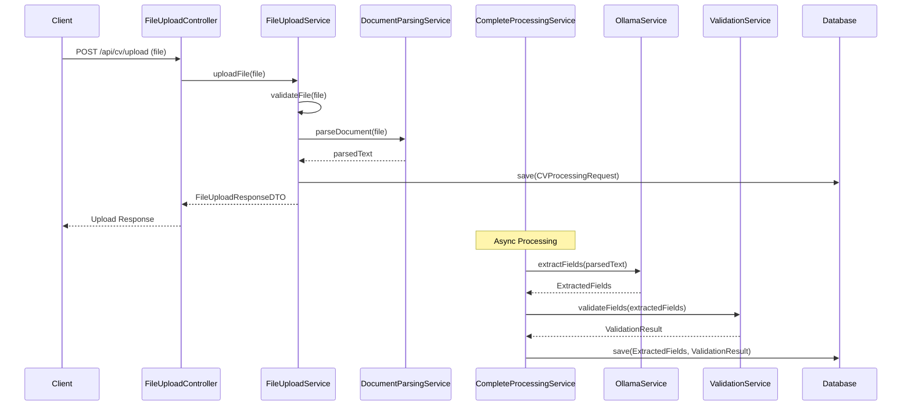
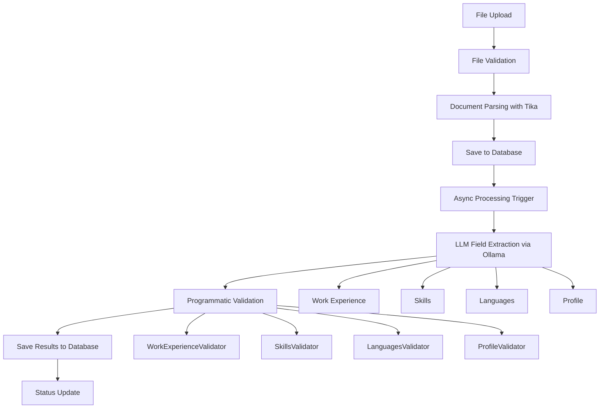

# CV Processing Application - Application Design

## Overview

A CV processing application that leverages Large Language Model (LLM) technology to extract specific fields from CV documents and validate the extracted data according to predefined rules. The application uses Ollama with Llama 3.2 1B model for local LLM processing.

## Functional Requirements

### 1. Document Upload
- REST endpoint for file upload
- Supported formats: PDF, DOC, DOCX
- File size limitations (10MB default)
- Security checks and validation
- Asynchronous processing support

### 2. Field Extraction
Fields to be extracted using LLM:
- **Work Experience**: Work experience in years and details
- **Skills**: List of skills
- **Languages**: List of languages
- **Profile**: Profile description

### 3. Validation Rules
Programmatic validation rules:
- **Work Experience**: Between 0-2 years
- **Skills**: Must include Java and LLM/AI
- **Languages**: Must include Hungarian and English
- **Profile**: Must include GenAI and Java interest

### 4. Processing Pipeline
- File upload and validation
- Document parsing with Apache Tika
- LLM field extraction via Ollama
- Programmatic validation
- Database persistence
- Status tracking and monitoring

### 5. Result
JSON response containing:
- Extracted field values
- Validation rule results
- Processing status
- Error messages and warnings

## Architecture

### Clean Architecture + DDD

```
┌─────────────────────────────────────────────────────────────┐
│                    Presentation Layer                       │
│  ┌─────────────────┐  ┌─────────────────┐  ┌──────────────┐ │
│  │   REST API      │  │   Validation    │  │   Exception  │ │
│  │   Controllers   │  │   Handlers      │  │   Handlers   │ │
│  └─────────────────┘  └─────────────────┘  └──────────────┘ │
└─────────────────────────────────────────────────────────────┘
                                │
┌─────────────────────────────────────────────────────────────┐
│                    Application Layer                        │
│  ┌─────────────────┐  ┌─────────────────┐  ┌──────────────┐ │
│  │   Use Cases     │  │   Services      │  │     DTOs     │ │
│  │   (Orchestration)│  │   (Business     │  │   (Data      │ │
│  │                 │  │    Logic)       │  │   Transfer)  │ │
│  └─────────────────┘  └─────────────────┘  └──────────────┘ │
└─────────────────────────────────────────────────────────────┘
                                │
┌─────────────────────────────────────────────────────────────┐
│                     Domain Layer                            │
│  ┌─────────────────┐  ┌─────────────────┐  ┌──────────────┐ │
│  │    Entities     │  │   Value Objects │  │  Validators  │ │
│  │   (Core Business│  │   (Business     │  │   (Business  │ │
│  │    Concepts)    │  │    Rules)       │  │    Rules)    │ │
│  └─────────────────┘  └─────────────────┘  └──────────────┘ │
└─────────────────────────────────────────────────────────────┘
                                │
┌─────────────────────────────────────────────────────────────┐
│                  Infrastructure Layer                       │
│  ┌─────────────────┐  ┌─────────────────┐  ┌──────────────┐ │
│  │   Ollama Client │  │   File Storage  │  │   External   │ │
│  │   (LLM Service) │  │   (Document     │  │   Services   │ │
│  │                 │  │    Handling)    │  │              │ │
│  └─────────────────┘  └─────────────────┘  └──────────────┘ │
└─────────────────────────────────────────────────────────────┘
```

## Processing Flow



## Technology Stack

### Core Framework
- **Spring Boot 3.2+**: Main framework
- **Spring Web**: REST API
- **Spring Validation**: Input validation
- **Spring Data JPA**: Database access
- **Spring Transaction**: Transaction management

### LLM Integration
- **Ollama**: Local LLM service
- **Llama 3.2 1B**: Lightweight model for field extraction
- **HTTP Client**: Ollama API communication
- **Resilience4j**: Circuit breaker, retry

### Database
- **PostgreSQL**: Primary database
- **Liquibase**: Database migration
- **HikariCP**: Connection pooling

### Document Processing
- **Apache Tika**: Document parsing (PDF, DOC, DOCX)
- **MultipartFile**: File upload handling

### Additional Libraries
- **Lombok**: Boilerplate reduction
- **Jackson**: JSON processing
- **Micrometer**: Metrics and monitoring
- **TestContainers**: Integration testing

## Key Components

### 1. Domain Layer
- **Entities**: CVProcessingRequest, ExtractedFields, ValidationResult
- **Validators**: WorkExperienceValidator, SkillsValidator, LanguagesValidator, ProfileValidator
- **ValidatorRegistry**: Centralized validator management
- **Exceptions**: Domain-specific exceptions

### 2. Application Layer
- **Services**: FileUploadService, CompleteProcessingService, ValidationService, AsyncProcessingService
- **DTOs**: FileUploadResponseDTO, ProcessingResultDTO, ValidationResultDTO
- **Orchestration**: Business logic coordination

### 3. Infrastructure Layer
- **Ollama Service**: LLM integration for field extraction
- **Document Parsing**: Apache Tika integration
- **File Validation**: File type and size validation
- **Repository**: Data persistence layer
- **Configuration**: External service setup

### 4. Presentation Layer
- **Controllers**: FileUploadController, CVProcessingController
- **Exception Handlers**: Global error management
- **Health Checks**: Service monitoring endpoints

## Data Flow



## Deployment Strategy

### Development
- **Docker Compose**: Local development environment with PostgreSQL and Ollama
- **TestContainers**: Integration testing with real database
- **Mock Services**: Ollama service mocking for unit tests

### Production
- **Docker**: Containerized deployment with Eclipse Temurin JRE
- **Environment Variables**: Configuration management
- **Health Checks**: Application and Ollama service monitoring
- **Logging**: Structured logging with Logback

## Performance Considerations

### Async Processing
- **CompletableFuture**: Non-blocking operations for LLM calls
- **Thread Pool**: Configurable thread management
- **Timeout Handling**: Request timeout management for Ollama

### Database Optimization
- **Connection Pooling**: HikariCP for PostgreSQL connections
- **Indexing**: Database indexes for performance
- **Liquibase**: Database migration management

### Monitoring
- **Metrics**: Application performance metrics with Micrometer
- **Health Checks**: Service health monitoring
- **Logging**: Comprehensive logging with correlation IDs

## Security

### File Security
- **File Type Validation**: PDF, DOC, DOCX only
- **Size Limits**: 10MB maximum file size
- **Content Validation**: Apache Tika content detection

### API Security
- **Input Validation**: Comprehensive input validation
- **Error Handling**: Secure error responses without sensitive data
- **File Name Sanitization**: Path traversal protection

## Testing Strategy

### Unit Testing
- **Domain Logic**: Business rule testing for validators
- **Services**: Service layer testing with mocks
- **Validators**: Individual validator testing

### Integration Testing
- **API Testing**: End-to-end API testing with TestContainers
- **Ollama Integration**: External service testing
- **Database Testing**: Data persistence testing with PostgreSQL

### Performance Testing
- **Load Testing**: High load scenarios
- **Memory Testing**: Large file handling
- **Ollama Performance**: LLM response time testing

## API Specification

### Endpoints
- **POST /api/cv/upload**: File upload endpoint
- **GET /api/cv/status/{requestId}**: Processing status endpoint
- **GET /api/health**: Health check endpoint
- **GET /api/health/ollama/ready**: Ollama service health check

### Request/Response Format
- **Content-Type**: multipart/form-data (file upload)
- **Response**: JSON with processing status and results
- **Error Handling**: Standard HTTP status codes with error details

## Database Schema

### Tables
- **cv_processing_requests**: File upload metadata and status
- **extracted_fields**: LLM extracted field values
- **validation_results**: Validation results and messages
- **validation_result_errors**: Error details
- **validation_result_warnings**: Warning details

### Relationships
- One-to-One: CVProcessingRequest -> ExtractedFields
- One-to-One: ExtractedFields -> ValidationResult
- One-to-Many: ValidationResult -> Errors/Warnings

## Future Enhancements

### Scalability
- **Message Queues**: Async processing with RabbitMQ/Kafka
- **Microservices**: Service decomposition
- **Load Balancing**: Horizontal scaling

### Features
- **Batch Processing**: Multiple file processing
- **Progress Tracking**: Real-time processing status
- **Result Export**: Export processed results to various formats

### Integration
- **Notification System**: Processing completion notifications
- **Audit Logging**: Comprehensive audit trail
- **API Rate Limiting**: Request rate limiting