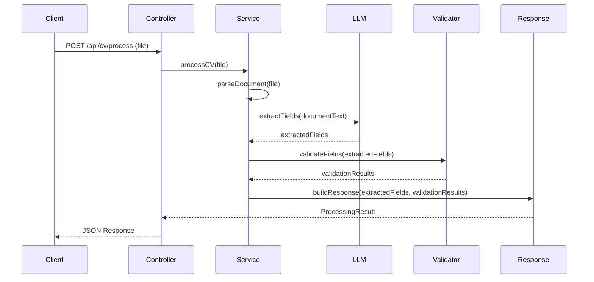
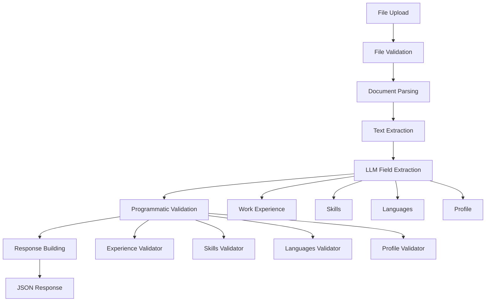

# CV Processing Application - Application Design

## 📋 Overview

A CV processing application that leverages Large Language Model (LLM) technology to extract specific fields from CV documents and validate the extracted data according to predefined rules.

## 🎯 Functional Requirements

### 1. Document Upload
- REST endpoint for file upload
- Supported formats: PDF, DOC, DOCX
- File size limitations
- Security checks

### 2. Field Extraction
Fields to be extracted using LLM:
- **Work Experience**: Work experience in years
- **Skills**: List of skills
- **Languages**: List of languages
- **Profile**: Profile description

### 3. Validation Rules
Programmatic validation rules:
- **Work Experience**: Between 0-2 years
- **Skills**: Must include Java and LLMs
- **Languages**: Must include Hungarian and English
- **Profile**: Must include GenAI and Java interest

### 4. Result
JSON response containing:
- Extracted field values
- Validation rule results

## 🏗️ Architecture

### Clean Architecture + DDD

```
┌─────────────────────────────────────────────────────────────┐
│                    Presentation Layer                       │
│  ┌─────────────────┐  ┌─────────────────┐  ┌──────────────┐ │
│  │   REST API      │  │   Validation    │  │   Exception  │ │
│  │   Controllers   │  │   Handlers      │  │   Handlers   │ │
│  └─────────────────┘  └─────────────────┘  └──────────────┘ │
└─────────────────────────────────────────────────────────────┘
                                │
┌─────────────────────────────────────────────────────────────┐
│                    Application Layer                        │
│  ┌─────────────────┐  ┌─────────────────┐  ┌──────────────┐ │
│  │   Use Cases     │  │   Services      │  │     DTOs     │ │
│  │   (Orchestration)│  │   (Business     │  │   (Data      │ │
│  │                 │  │    Logic)       │  │   Transfer)  │ │
│  └─────────────────┘  └─────────────────┘  └──────────────┘ │
└─────────────────────────────────────────────────────────────┘
                                │
┌─────────────────────────────────────────────────────────────┐
│                     Domain Layer                            │
│  ┌─────────────────┐  ┌─────────────────┐  ┌──────────────┐ │
│  │    Entities     │  │   Value Objects │  │  Validators  │ │
│  │   (Core Business│  │   (Business     │  │   (Business  │ │
│  │    Concepts)    │  │    Rules)       │  │    Rules)    │ │
│  └─────────────────┘  └─────────────────┘  └──────────────┘ │
└─────────────────────────────────────────────────────────────┘
                                │
┌─────────────────────────────────────────────────────────────┐
│                  Infrastructure Layer                       │
│  ┌─────────────────┐  ┌─────────────────┐  ┌──────────────┐ │
│  │   OpenAI Client │  │   File Storage  │  │   External   │ │
│  │   (LLM Service) │  │   (Document     │  │   Services   │ │
│  │                 │  │    Handling)    │  │              │ │
│  └─────────────────┘  └─────────────────┘  └──────────────┘ │
└─────────────────────────────────────────────────────────────┘
```

## 🔄 Processing Flow



## 📁 Project Structure

```
src/main/java/com/intuitech/cvprocessor/
├── domain/
│   ├── model/
│   │   ├── CVProcessingRequest.java
│   │   ├── ExtractedFields.java
│   │   ├── WorkExperience.java
│   │   ├── Skills.java
│   │   ├── Languages.java
│   │   └── Profile.java
│   ├── validator/
│   │   ├── WorkExperienceValidator.java
│   │   ├── SkillsValidator.java
│   │   ├── LanguagesValidator.java
│   │   └── ProfileValidator.java
│   └── service/
│       └── FieldExtractionService.java
├── application/
│   ├── usecase/
│   │   └── ProcessCVUseCase.java
│   ├── service/
│   │   └── CVProcessingService.java
│   └── dto/
│       ├── ProcessingRequestDTO.java
│       ├── ProcessingResponseDTO.java
│       └── ValidationResultDTO.java
├── infrastructure/
│   ├── llm/
│   │   ├── OpenAIClient.java
│   │   ├── FieldExtractor.java
│   │   └── PromptBuilder.java
│   ├── storage/
│   │   └── FileStorageService.java
│   └── config/
│       ├── OpenAIConfig.java
│       └── ApplicationConfig.java
└── presentation/
    ├── controller/
    │   └── CVProcessingController.java
    ├── exception/
    │   ├── GlobalExceptionHandler.java
    │   └── CVProcessingException.java
    └── validation/
        └── FileValidation.java
```

## 🛠️ Technology Stack

### Core Framework
- **Spring Boot 3.2+**: Main framework
- **Spring Web**: REST API
- **Spring Validation**: Input validation
- **Spring Security**: Security (optional)

### LLM Integration
- **OpenAI Java SDK**: GPT-4.1 integration
- **Resilience4j**: Circuit breaker, retry
- **Jackson**: JSON processing

### Additional Libraries
- **MapStruct**: DTO mapping
- **Lombok**: Boilerplate reduction
- **Apache Tika**: Document parsing
- **Micrometer**: Metrics

## 🔧 Key Components

### 1. Domain Layer
- **Entities**: Core business concepts
- **Value Objects**: Immutable business rules
- **Validators**: Business rule validation

### 2. Application Layer
- **Use Cases**: Application-specific business logic
- **Services**: Orchestration of domain operations
- **DTOs**: Data transfer between layers

### 3. Infrastructure Layer
- **OpenAI Client**: LLM integration
- **File Storage**: Document handling
- **Configuration**: External service setup

### 4. Presentation Layer
- **Controllers**: REST endpoints
- **Exception Handlers**: Error management
- **Validation**: Input validation

## 📊 Data Flow



## 🚀 Deployment Strategy

### Development
- **Docker Compose**: Local development environment
- **H2 Database**: In-memory database for testing
- **Mock Services**: External service mocking

### Production
- **Docker**: Containerized deployment
- **Environment Variables**: Configuration management
- **Health Checks**: Application monitoring
- **Logging**: Structured logging with correlation IDs

## 📈 Performance Considerations

### Async Processing
- **CompletableFuture**: Non-blocking operations
- **Thread Pool**: Configurable thread management
- **Timeout Handling**: Request timeout management

### Caching
- **Response Caching**: Repeated request optimization
- **Connection Pooling**: LLM API connection management

### Monitoring
- **Metrics**: Application performance metrics
- **Tracing**: Request tracing
- **Health Checks**: Service health monitoring

## 🔒 Security

### File Security
- **File Type Validation**: Allowed file types only
- **Size Limits**: Maximum file size restrictions
- **Content Scanning**: Malicious content detection

### API Security
- **Rate Limiting**: Request rate limiting
- **Input Validation**: Comprehensive input validation
- **Error Handling**: Secure error responses

## 🧪 Testing Strategy

### Unit Testing
- **Domain Logic**: Business rule testing
- **Validators**: Validation logic testing
- **Services**: Service layer testing

### Integration Testing
- **API Testing**: End-to-end API testing
- **LLM Integration**: External service testing
- **Database Testing**: Data persistence testing

### Performance Testing
- **Load Testing**: High load scenarios
- **Stress Testing**: System limits testing
- **Benchmarking**: Performance comparison

## 📝 API Specification

### Endpoints
- **POST /api/cv/process**: CV processing endpoint
- **GET /api/health**: Health check endpoint
- **GET /api/metrics**: Application metrics

### Request/Response Format
- **Content-Type**: multipart/form-data (file upload)
- **Response**: JSON with extracted fields and validation results
- **Error Handling**: Standard HTTP status codes with error details

## 🔄 Future Enhancements

### Scalability
- **Message Queues**: Async processing with queues
- **Microservices**: Service decomposition
- **Load Balancing**: Horizontal scaling

### Features
- **Batch Processing**: Multiple file processing
- **Progress Tracking**: Real-time processing status
- **Result Export**: Export processed results

### Integration
- **Database Storage**: Persistent result storage
- **Notification System**: Processing completion notifications
- **Audit Logging**: Comprehensive audit trail